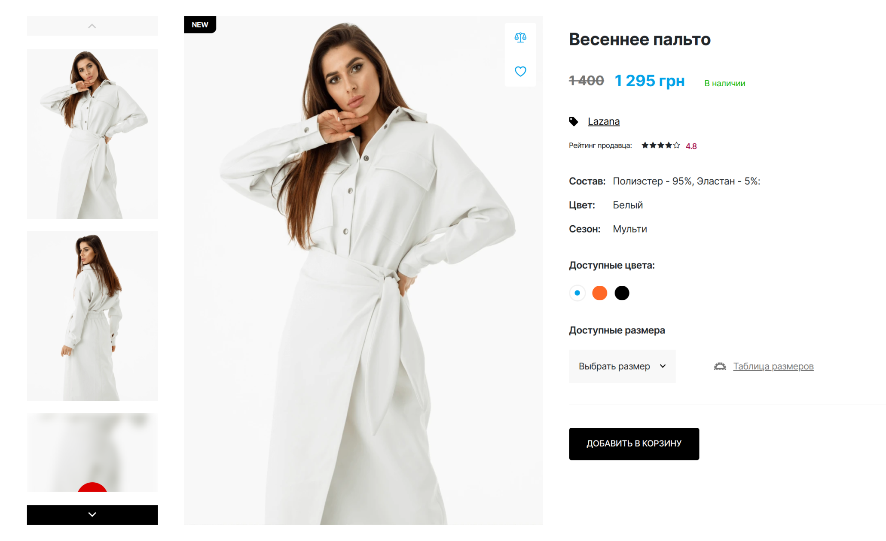
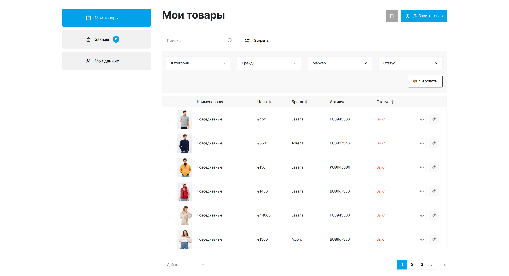

# **BeinUA**

The **BeinUA** is a ukrainian project that specializes in creating an online platform for sellers and buyers of clothing.

**Developers:**

- [Dmitry Tavern (developer)](https://github.com/dmitrytavern).
- [Lyovushkin Kyrylo (designer)](https://www.instagram.com/k.lyovushkin/).

**Screenshot:**


## Formulation of the problem

Create a cross-browser, adaptive website by design in Sketch. Key points for adaptability: **375px**, **768px**, **1100px**, **1600px**. There are no additional requirements.

Pages to create:

- [Home](https://dmitrytavern.github.io/website-makeup-beinua/)
- [Catalog](https://dmitrytavern.github.io/website-makeup-beinua/catalog.html)
- [Inner product](https://dmitrytavern.github.io/website-makeup-beinua/product.html)
- [Registration](https://dmitrytavern.github.io/website-makeup-beinua/registration.html)
- [Seller account](https://dmitrytavern.github.io/website-makeup-beinua/account-seller-home.html)
- [Buyer account](https://dmitrytavern.github.io/website-makeup-beinua/account-buyer-orders.html)

## Technologies

&nbsp;
&nbsp;
&nbsp;
&nbsp;
&nbsp;
&nbsp;
&nbsp;
&nbsp;
&nbsp;
&nbsp;
&nbsp;
&nbsp;
&nbsp;
&nbsp;
&nbsp;
&nbsp;

To build the project, self-written scripts were used.

## Performance

For phones, performance is not very high, unlike desktop. The site has serious problems, which are discussed in the "Conclusions" section:

&nbsp;
&nbsp;

## Problems

### 01. Implementation of custom filter

Although it was a long time ago, I remember exactly that it was quite problematic to implement a filter on the [catalog page](https://dmitrytavern.github.io/website-makeup-beinua/catalog.html). The main problem was that this filter should dynamically change products, so it had to be done taking into account the wishes of the back-end developer.

The filter should change the field values depending on the user's choice and be adaptive.

**Solution:** everything was implemented in jQuery.


### 02. Implementation of dual slider

On the [inner page of the product](https://dmitrytavern.github.io/website-makeup-beinua/product.html), the product itself is presented using a double slider. And this wouldn't be a problem if one of the sliders wasn't vertical. Its problem is that, by design, its height should be equal to the height of the large slider.

**Solution:** after a lot of experimentation, it was decided to hardcode it through scripts. Maybe now I would find another solution.



### 03. Implementing a dynamic product table

It was necessary to create a dynamic table of goods, which should be able to sort by columns, have different filters and a search engine.

**Solution:** The table was implemented in Vue.js. Sorting and inferior pagination too.



## Conclusions

Since I'm watching this project three years after it was written, I see a huge number of mistakes that I made earlier.

- **CDN.** All libraries have been cdn-linked, which is obviously a bad idea. This greatly affects performance.

- **Self-written builder.** At that time, it was interesting for me to write build scripts purely for myself, and in the past this gave a good boost to knowledge and experience. Now this is the worst possible idea, since it requires a gigantic amount of time to maintain this collector. For such sites it is better to use gulp.

- **A lot of scripts.** I include Vue.js, Simplebar.js, Swiper, jQuery, Popper.js, Bootstrap.js. This is too much for such a site and now it is possible to optimize it very well.

- **Dynamic table.** On the [seller's page](https://dmitrytavern.github.io/website-makeup-beinua/account-seller-home.html), in the tab with goods, a dynamic table was implemented. There was no point in it, since, in theory, this logic falls on the developer's backend. It should have been discussed beforehand.

- **Vue along with jQuery.** It's just a very strange decision. Perhaps the use of vue in this project is superfluous.

## Guide

If you only need a finished build, you can download it from the [latest release](https://github.com/dmitrytavern/website-makeup-beinua/releases/latest/download/website-makeup.tar.gz).

This project is very out of date, so make sure you are using **Node.js v16.20.0**. Also, be prepared for the problems of a custom builder. There may also be problems running on **Windows** or **MacOS**.

Steps to manually build a project:

1. Clone a repository:

```
git clone https://github.com/dmitrytavern/website-makeup-beinua.git
```

2. Install dependencies:

```
npm ci
```

3. Run a command:

```
npm run dev
npm run build
npm run build:serve
```

- **npm run dev** - launches a live-reload webpack dev server for development.
- **npm run build** - builds the entire project in a production version.
- **npm run build:serve** - runs the production server to test the finished build.

## License

MIT - check repo files

Copyright (c) 2020-present, Dmitry Tavern
